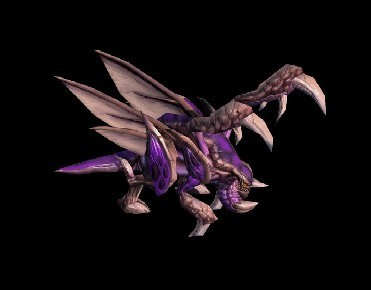
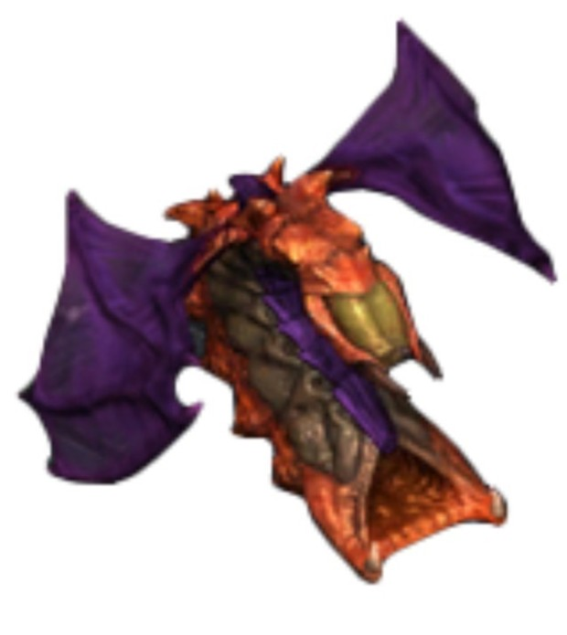

# 저그 정석 빌드 #
### 1. 오버풀
q빌드: 9 오버로드 >8드론 >9가스 생산 후 취소하고 드론>10 스포닝풀>라바모아서 저글링

### 2. 12풀
빌드:9오버로드>8드론>9가스생산 후 취소하고 드론>12드론(계속)>스포닝풀>11해처리>드론>11가스>11드론

# 저그 주요 유닛  

### 저글링

### 히드라

### 뮤탈리스크 
  

# 저그의 장단점

## 장점 : 값이 싸고 유닛 나오는 속도가 빠르다.

## 단점 : 공격력이 약하고 HP가 낮다 

# 저그 프로게이머 

## 홍진호

## 이제동
